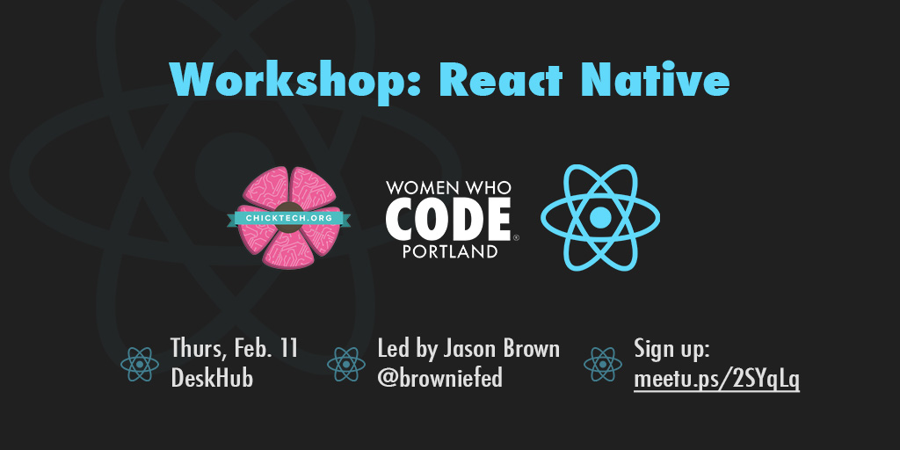

# Workshops

## 2015

### Rapid Prototyping - Mon, Dec. 14
- **Instructor:** Caterina [@caterinasworld](http://github.com/caterinasworld)  
- GitHub Repo [here](https://github.com/caterinasworld/rapid-prototyping-workshop)

## 2016

### iOS vs Android Development - Thu, Jan. 21, Jan. 28, and Feb. 4
- **iOS Instructor:** Anne [@annelindsley](http://github.com/annelindsley)  
- Slides [here](http://docs.google.com/presentation/d/1nQ6lpclnDxTyXvNgV46W1xboY-4l6col9Np0VpRByOU/edit#slide=id.p) + GitHub Repo [here](http://github.com/annelindsley/BasicWeatherAppIOS)  
- **Android Instructor:** Kat [@katmitchell](http://github.com/katmitchell)  
- Slides [here](http://docs.google.com/presentation/d/15zeffegzsIjA9g44wP9Kjlk0YHjdSf6VQvqV5u3rsCI/edit#slide=id.p) + GitHub Repo [here](http://github.com/katmitchell/ChickTechWeatherAppAndroid)

### React Native - Thu, Feb. 11
- **Instructor:** Jason [@browniefed](http://github.com/browniefed)  
- Slides [here](http://slides.com/browniefed/react-native#/) + GitHub Repo [here](http://github.com/browniefed/forecast)
- 

### Git, GitHub, and Contributing to Open Source - Thu, Jul. 19
- **Instructors:** Tiffany [@tiffanyfj](https://github.com/tiffanyfj) and Scott [@shanselman](https://github.com/shanselman)
- GitHub Repo [here](https://github.com/wwcodeportland/git-github-os)
- 

### Intro to IoT - Thu, Oct. 20
- Instructor: TBA
